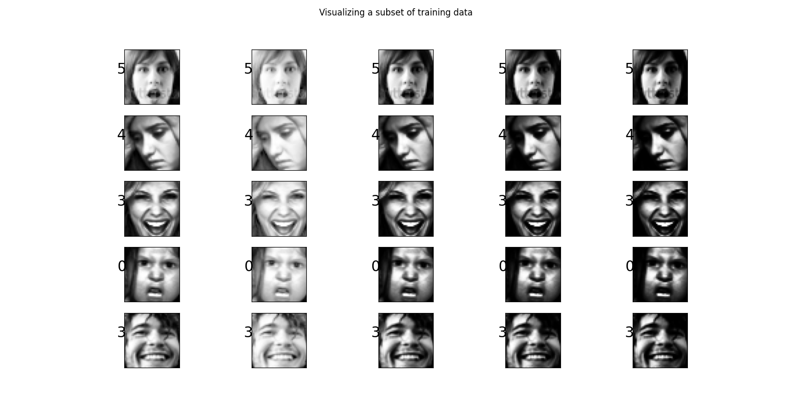
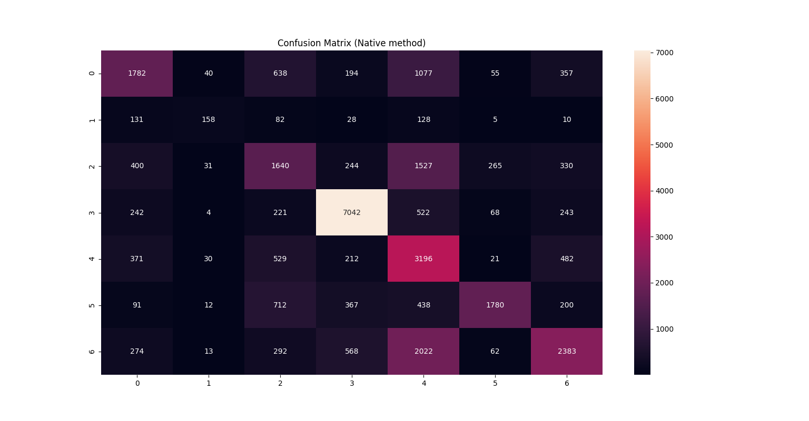
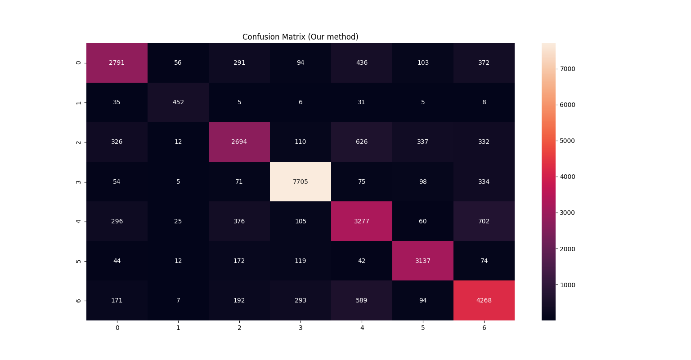

# 😃 Facial Emotion Recognition

## 📘 Digital Image Processing (DIP) Course Project

---

## 🧠 Abstract

In this project, we tackle key challenges in facial emotion recognition using a deep learning approach based on the Mini-Xception architecture. By introducing advanced preprocessing techniques, we address problems such as lighting conditions, cultural variations, and occlusions. We compare the model’s performance with and without these enhancements, showing a notable improvement in accuracy and F1 score.

---

## 🧩 Problem Statement

Facial emotion recognition faces hurdles due to:
- Poor lighting
- Varying face orientations
- Ethnic and cultural diversity

Our solution enhances model accuracy by introducing preprocessing steps that target each of these specific problems.

---

## 📝 Introduction

We reviewed current limitations in facial emotion recognition and focused on four major issues:
- Lighting inconsistencies
- Face occlusion
- Racial and skin tone differences
- Cultural variation in emotion expression

We combined traditional image processing methods with a deep learning pipeline to improve robustness and generalization.

---

## 📂 Dataset

- **FER2013 Dataset**: 27,000+ grayscale 48x48 images categorized into 7 emotions:
  - 0 = Angry
  - 1 = Disgust
  - 2 = Fear
  - 3 = Happy
  - 4 = Sad
  - 5 = Surprise
  - 6 = Neutral

- **Multicultural Dataset**: Scraped from Google Images (American, African, Asian, Hispanic).
  - Labeled using a pseudo-labeling technique.



---

## 🧪 Approach

We developed a preprocessing pipeline in 5 stages:

1. **Lighting Issues**
   - Solved using Histogram Equalization to normalize brightness.

2. **Skin Tone Differences**
   - Augmented grayscale images with varied intensities to simulate skin tone diversity.

3. **Cultural Differences**
   - Included multicultural data scraped from the web and labeled via pseudo-labeling.

4. **Face Occlusion**
   - Applied face segmentation and numerical encoding to handle partial occlusions (e.g., masks, glasses).

5. **Pseudo Labelling**
   - Used a pre-trained model to label new multicultural data for retraining.

---

## 🧬 Procedure

1. Train the model on the original FER2013 dataset.
2. Apply preprocessing techniques to generate a new training dataset.
3. Retrain the model and compare results.
4. Analyze performance metrics across both approaches.

---

## 🛠️ Installation

```bash
pip install -r requirements.txt
```

---

## ▶️ Run the Model

```bash
python real_time_video.py
```

---

## 📈 Train the Model

```bash
python train_emotion_classifier.py
```

---

## 📊 Results

| Model                     | Train Accuracy | Test Accuracy | F1 Score |
|--------------------------|----------------|----------------|----------|
| Usual Preprocessing      | 70%            | 66%            | 0.5719   |
| Custom Preprocessing     | 76%            | 75%            | 0.7703   |

---

## 🎯 Conclusion

Our custom preprocessing pipeline significantly improved model performance:
- **+9% Accuracy**
- **+20% F1 Score**

The techniques effectively reduced bias caused by lighting, ethnicity, and cultural diversity, enhancing the model's generalization to real-world scenarios.

---

### 🔍 Confusion Matrices

**Original Method**  


**Our Method**  


---

## 👥 Team

- **Shaik Masihullah**
- **Shikhar Arya**
- **Kalyan Inguva**
- **Rithika Nenavath**

---

## 🙌 Credits

- [Emotion Recognition – GitHub](https://github.com/omar178/Emotion-recognition)
